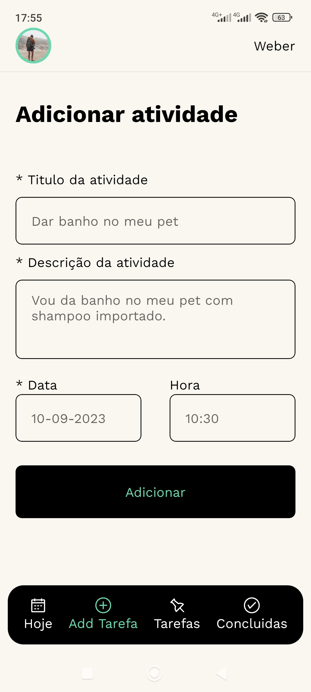
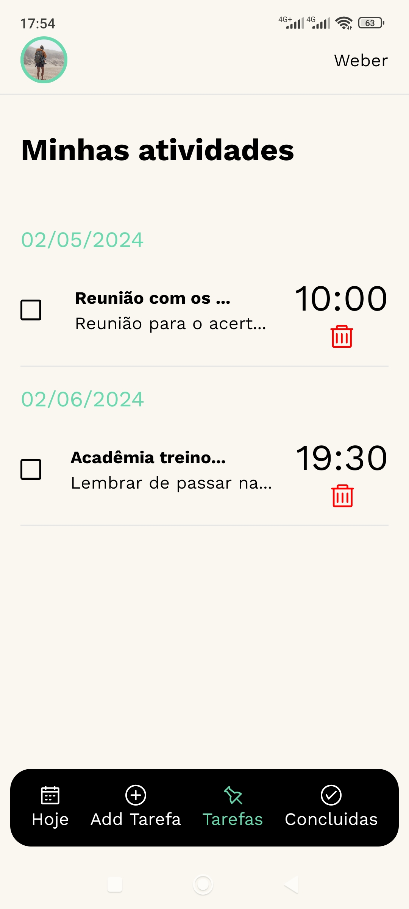
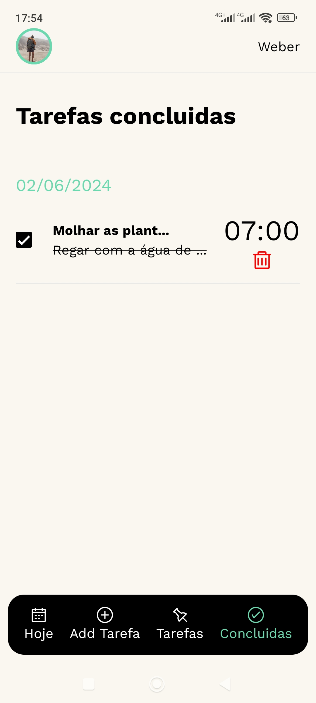

# Bem-vindo ao Task List APP 🚀

Bem-vindo ao Private Task List, um aplicativo de lista de tarefas projetado para ser totalmente editável e intuitivo. Este app, embora simples, foi desenvolvido com uma organização meticulosa para proporcionar uma experiência de usuário agradável.

**Características Principais:**

-   **Totalmente Editável:** Personalize suas listas e tarefas de acordo com suas necessidades. O Private Task List adapta-se ao seu estilo de gerenciamento de tarefas.
-   **Simples e Organizado:** Nossa abordagem minimalista torna a navegação fácil e eficiente. Concentre-se no que é mais importante: suas tarefas.

**O Futuro é Promissor:**
Estamos comprometidos em fazer do Private Task List a melhor ferramenta para organização pessoal e produtividade. Em breve, estaremos adicionando mais funcionalidades e melhorias. Fique atento para atualizações emocionantes!

**Contribua para o Nosso Ecossistema:**
Para tornar este projeto ainda mais incrível, convidamos você a contribuir! O Private Task List é de código aberto, e sua participação é crucial para a evolução constante. Sua criatividade e habilidades podem moldar o futuro deste aplicativo.

**Backend em Breve:**
Estamos animados em anunciar que o backend estará disponível em breve no repositório [Private Task List Backend](https://github.com/webrcost4/private-task-list-app-backend). Isso abrirá novas oportunidades para integrações e personalizações avançadas. Junte-se a nós nessa jornada emocionante!

Sua contribuição é mais do que bem-vinda. Juntos, podemos construir uma comunidade vibrante e tornar o Private Task List ainda mais incrível. Obrigado por fazer parte deste projeto emocionante! 🚀

